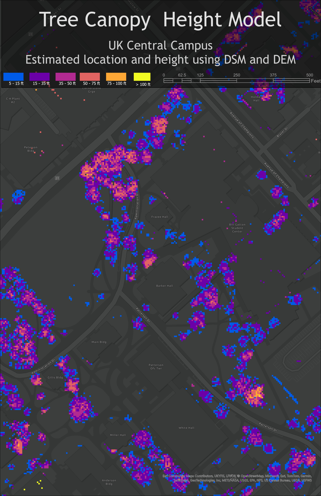

# GEO409 Field Trip Maps
The following are maps for field trip to measure tree canopy heights

Kentucky counties with selected land cover types - [Download geospatial PDF]()

UK Central campus canopy model - [Download geospatial PDF](CanopyHeightModel.pdf)

Maps created by Schimpffafa for GEO409, SP2024, University of Kentucky